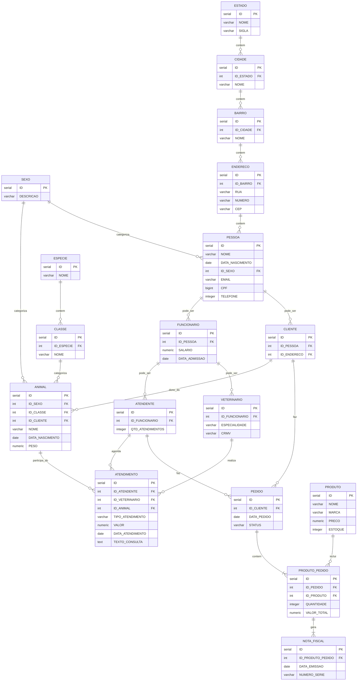

# 🐾 MeuPET — Aplicativo para Clínica Veterinária
## 📋 Apresentação do Projeto
**MeuPET** será uma aplicação para um trabalho das disciplinas de Introdução a Banco de Dados e de Engenharia de Software com o tema "Clínica Veterinária", focando nos serviços de tratamento de animais domésticos e venda de produtos pet. O objetivo geral da aplicação é centralizar o atendimento ao cliente, facilitando o agendamento de consultas, o acompanhamento da saúde dos pets e a compra de produtos.

**Público-alvo:** Clínica veterinária fictícia que deseja digitalizar e otimizar sua gestão de atendimentos e vendas, além dos possíveis clientes da clínica que são donos de animais domésticos (cães e gatos) que buscam praticidade no cuidado com seus animais.

## Modelo de Dados

```mermaid
erDiagram
    SEXO ||--o{ PESSOA : categoriza
    SEXO ||--o{ ANIMAL : categoriza
    ESTADO ||--o{ CIDADE : contem
    CIDADE ||--o{ BAIRRO : contem
    BAIRRO ||--o{ ENDERECO : contem
    ENDERECO ||--o{ PESSOA : contem
    PESSOA ||--o{ CLIENTE : pode_ser
    PESSOA ||--o{ FUNCIONARIO : pode_ser
    CLIENTE ||--o{ PEDIDO : faz
    CLIENTE ||--o{ ANIMAL : dono_do
    ESPECIE ||--o{ CLASSE : contem
    CLASSE ||--o{ ANIMAL : categoriza
    ANIMAL ||--o{ ATENDIMENTO : participa_do
    VETERINARIO ||--o{ ATENDIMENTO : realiza
    ATENDENTE ||--o{ PEDIDO : faz
    ATENDENTE ||--o{ ATENDIMENTO : agenda
    FUNCIONARIO ||--o{ VETERINARIO : pode_ser
    FUNCIONARIO ||--o{ ATENDENTE : pode_ser
    PEDIDO ||--|{ PRODUTO_PEDIDO : contem
    PRODUTO_PEDIDO ||--|{ NOTA_FISCAL : gera
    PRODUTO ||--o{ PRODUTO_PEDIDO : inclui

    SEXO {
        serial ID PK
        varchar DESCRICAO
    }
    ESTADO {
        serial ID PK
        varchar NOME
        varchar SIGLA
    }
    CIDADE {
        serial ID PK
        int ID_ESTADO FK
        varchar NOME
    }
    BAIRRO {
        serial ID PK
        int ID_CIDADE FK
        varchar NOME
    }
    ENDERECO {
        serial ID PK
        int ID_BAIRRO FK
        varchar RUA
        varchar NUMERO
        varchar CEP
    }
    ESPECIE {
        serial ID PK
        varchar NOME
    }
    CLASSE {
        serial ID PK
        int ID_ESPECIE FK
        varchar NOME
    }
    PESSOA {
        serial ID PK
        varchar NOME
        date DATA_NASCIMENTO
        int ID_SEXO FK
        varchar EMAIL
        bigint CPF
        integer TELEFONE
    }
    FUNCIONARIO {
        serial ID PK
        int ID_PESSOA FK
        numeric SALARIO
        date DATA_ADMISSAO
    }
    ATENDENTE {
        serial ID PK
        int ID_FUNCIONARIO FK
        integer QTD_ATENDIMENTOS
    }
    VETERINARIO {
        serial ID PK
        int ID_FUNCIONARIO FK
        varchar ESPECIALIDADE
        varchar CRMV
    }
    CLIENTE {
        serial ID PK
        int ID_PESSOA FK
        int ID_ENDERECO FK
    }
    ANIMAL {
        serial ID PK
        int ID_SEXO FK
        int ID_CLASSE FK
        int ID_CLIENTE FK
        varchar NOME
        date DATA_NASCIMENTO
        numeric PESO
    }
    ATENDIMENTO {
        serial ID PK
        int ID_ATENDENTE FK
        int ID_VETERINARIO FK
        int ID_ANIMAL FK
        varchar TIPO_ATENDIMENTO
        numeric VALOR
        date DATA_ATENDIMENTO
        text TEXTO_CONSULTA
    }
    PEDIDO {
        serial ID PK
        int ID_CLIENTE FK
        date DATA_PEDIDO
        varchar STATUS
    }
    PRODUTO {
        serial ID PK
        varchar NOME
        varchar MARCA
        numeric PRECO
        integer ESTOQUE
    }
    PRODUTO_PEDIDO {
        serial ID PK
        int ID_PEDIDO FK
        int ID_PRODUTO FK
        integer QUANTIDADE
        numeric VALOR_TOTAL
    }
    NOTA_FISCAL {
        serial ID PK
        int ID_PRODUTO_PEDIDO FK
        date DATA_EMISSAO
        varchar NUMERO_SERIE
    }
```