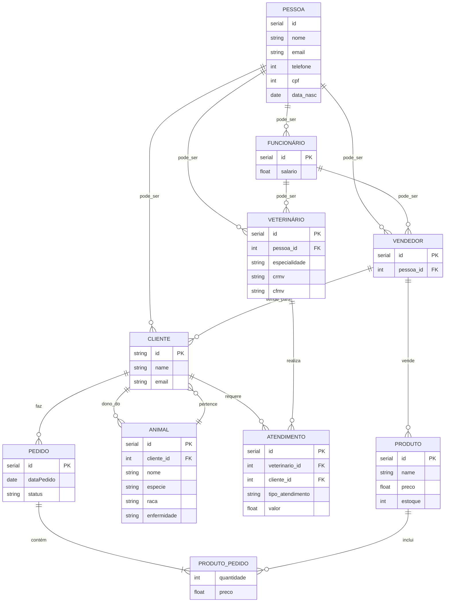

# APP-CLINICA-VETERINARIA
## Trabalho da disciplina de Introdução a Banco de Dados com o tema "Clínica Veterinária"
O objetivo, por enquanto, é criar a estrutura inicial de pastas e arquivos do projeto, uma versão inicial do banco de dados e o modelo de dados do projeto, utilizando o diagrama MERMAID para representar as tabelas e relações.

## Modelo de Dados

